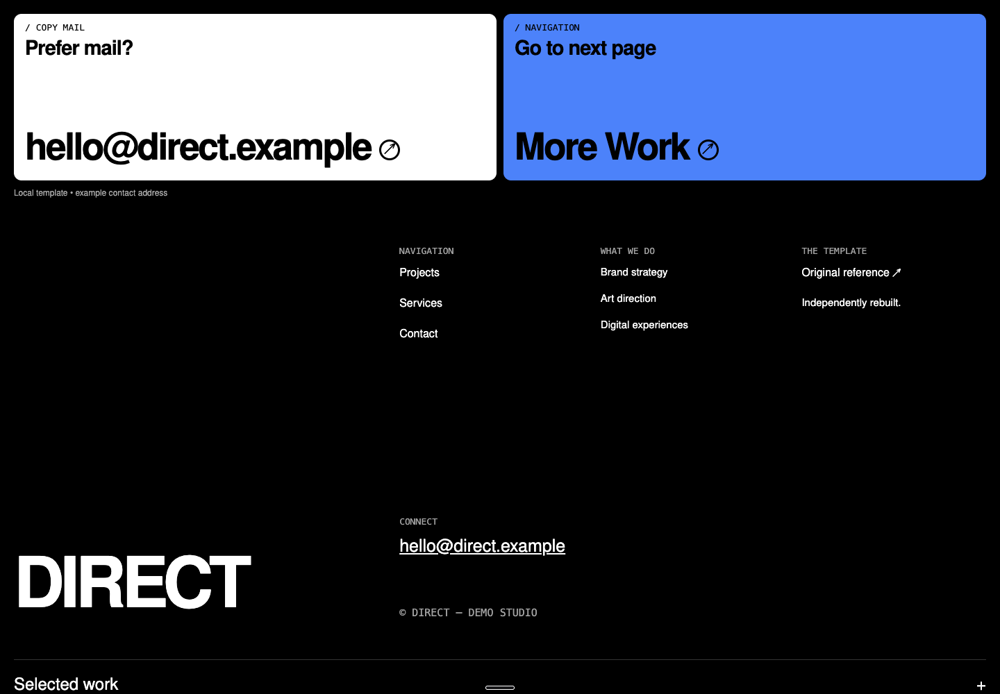
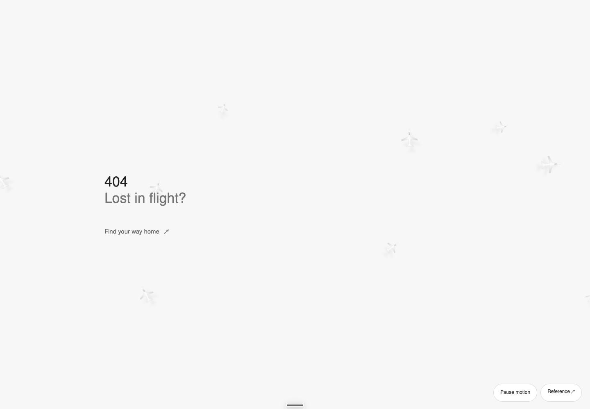
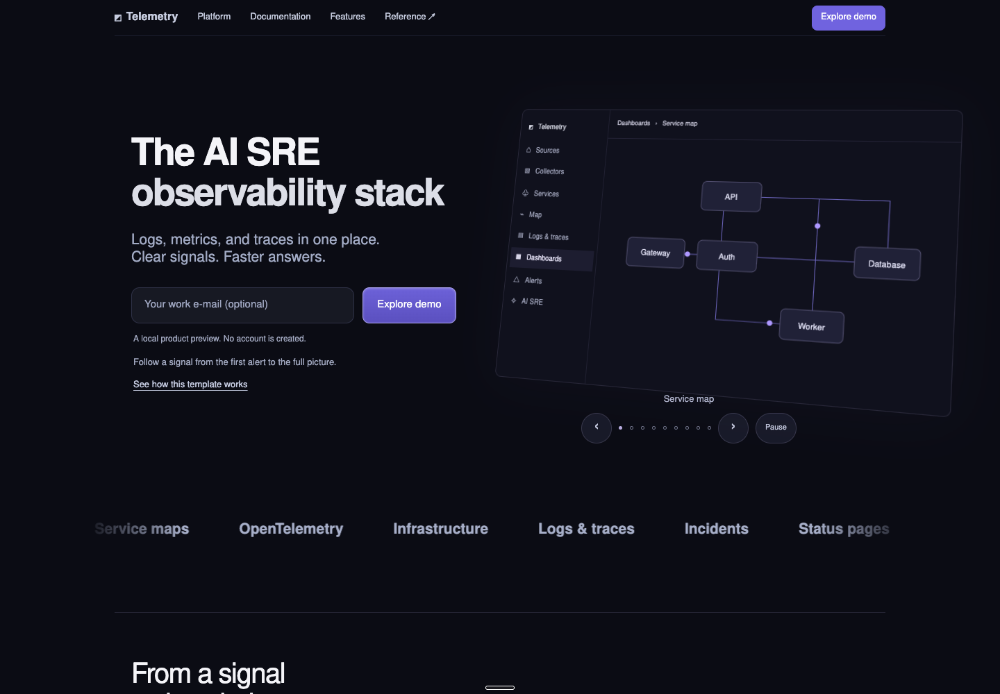
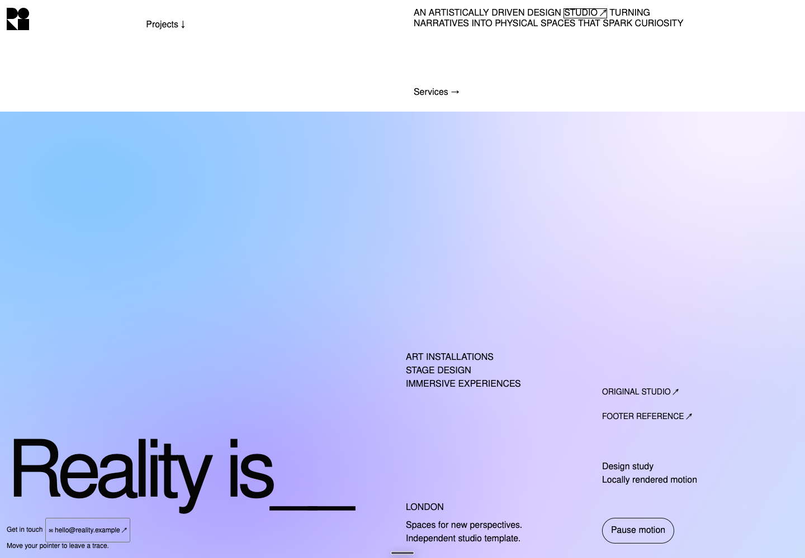
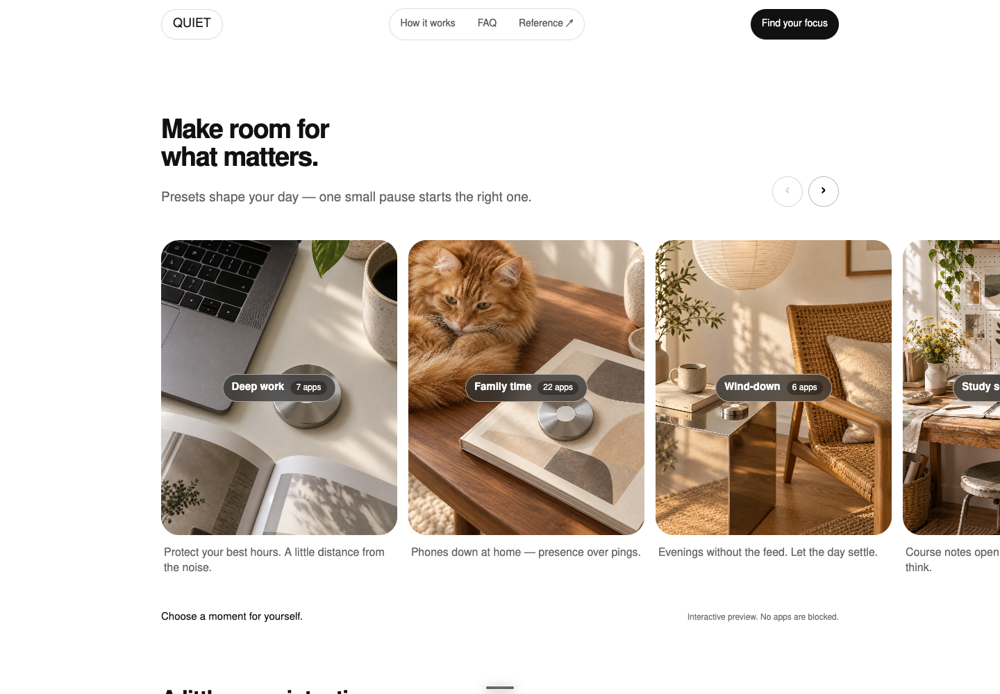

# X Web Templates

**[Browse all fifteen live templates](https://x-web-templates.pages.dev/)**

Fifteen reusable templates: reference-led reconstructions and your original Aster import. Original ChatGPT-generated artwork, editable HTML/CSS/JavaScript, and local fonts. No runtime dependencies or API keys.

| Template | Live preview | Direction | Working interactions |
| --- | --- | --- | --- |
| [Alpine Notes](templates/alpine-notes/) | [Open ↗](https://x-web-templates.pages.dev/alpine-notes/) | Blue mountain product page | Local note save, reload, export, paper colors |
| [Rainbow Venture](templates/rainbow-venture/) | [Open ↗](https://x-web-templates.pages.dev/rainbow-venture/) | White venture page with rainbow racing | Native FAQ, validated introduction draft download |
| [Bloop](templates/bloop/) | [Open ↗](https://x-web-templates.pages.dev/bloop/) | Six-panel lime identity board | Native template disclosure, brand-notes download |
| [Furion](templates/furion/) | [Open ↗](https://x-web-templates.pages.dev/furion/) | Six-panel monochrome identity board | Native template disclosure, brand-notes download |
| [Aster](templates/aster/) | [Open ↗](https://x-web-templates.pages.dev/aster/) | Layered observatory learning-product page | Original parallax, mobile menu, FAQs, choice controls |
| [HorizonX](templates/horizonx/) | [Open ↗](https://x-web-templates.pages.dev/horizonx/) | Navy and gold cosmic landing page | Pauseable scene, section navigation, native disclosures |
| [BuzzKit](templates/buzzkit/) | [Open ↗](https://x-web-templates.pages.dev/buzzkit/) | Notification-platform page | Four dashboard views, keyboard navigation, pause, preferences, FAQs |
| [Pixel World](templates/pixel-world/) | [Open ↗](https://x-web-templates.pages.dev/pixel-world/) | Illustrated developer portfolio | Layered scene, portfolio links, validated local contact-draft download |
| [GRID01 / Leo Mazzi](templates/grid-driver/) | [Open ↗](https://x-web-templates.pages.dev/grid-driver/) | Racing & Portfolio | Helmet reveal, pointer trails, circuit lap, and stacked season cards. |
| [Clipdock](templates/clipdock/) | [Open ↗](https://x-web-templates.pages.dev/clipdock/) | Product & Navigation | A notched menu, blue landscape, and editable clipboard preview. |
| [Telemetry](templates/telemetry-stack/) | [Open ↗](https://x-web-templates.pages.dev/telemetry-stack/) | Observability & SaaS | Nine dashboard scenes, keyboard controls, and pauseable autoplay. |
| [Lost in Flight](templates/lost-in-flight/) | [Open ↗](https://x-web-templates.pages.dev/lost-in-flight/) | Creative 404 | Dimensional planes in motion, with a working route home. |
| [Reality is](templates/reality-studio/) | [Open ↗](https://x-web-templates.pages.dev/reality-studio/) | Studio & Footer | A drifting atmosphere and geometric trails that follow your pointer. |
| [Direct](templates/direct-cta/) | [Open ↗](https://x-web-templates.pages.dev/direct-cta/) | Agency & Call To Action | Two bold CTA cards, rotating arrows, and a local work reveal. |
| [Quiet](templates/quiet-presets/) | [Open ↗](https://x-web-templates.pages.dev/quiet-presets/) | Product & Feature Section | A swipeable focus-preset gallery with tactile lifestyle photography. |

## Original designs and credits

The original four designs come from **[Naty / @DesignGuru01 — original X post](https://x.com/DesignGuru01/status/2097570950543790295)**. This collection reconstructs those references; it is not affiliated with their creator.

- **Aster:** Ali's [original Aster template repository](https://github.com/ali-abassi/aster-landing-page-template), imported with its MIT license. Its documented visual reference is [Unive](https://unive.ai/).
- **HorizonX reference:** [Viktor Oddy / @viktoroddy — original post](https://x.com/viktoroddy/status/2097500666357072243).
- **BuzzKit reference:** [Christo / @chroxify — original post](https://x.com/chroxify/status/2097477196130529296).
- **Pixel-world reference:** [Varun / @orseliyas — original post](https://x.com/orseliyas/status/2097307376143773730).

Each reconstruction credits its source. Aster’s runtime is unchanged. The seven motion additions independently reconstruct one selected example per library below; their individual READMEs identify the exact original page.

## Design inspiration libraries

More references shared by Ali, via **[Dzianis Kravchu / @thedzianis — original post](https://x.com/thedzianis/status/2097600028416381178)**:

| Library | Useful for |
| --- | --- |
| [GetLayers](https://www.getlayers.ai/) | Cinematic website templates, immersive website prompts and 3D scene prompts |
| [Navbar Gallery](https://www.navbar.gallery/) | Navigation patterns: static bars, dropdowns, mega menus and sidebars |
| [Supahero](https://supahero.io/) | Website hero-section references |
| [404s](https://www.404s.design/) | Creative error-page designs |
| [Footer](https://www.footer.design/) | Footer layouts and design references |
| [CTA Gallery](https://www.cta.gallery/) | Call-to-action sections |
| [Unsection](https://www.unsection.com/) | Website sections, including heroes, pricing and calls to action |

One selected example from each library is now a working motion template: **Kimi → GRID01**, **Supaste → Clipdock**, **Better Stack → Telemetry**, **Gabriel Beaugonin → Lost in Flight**, **Reality is → Reality is**, **Direct → Direct**, and **Norma → Quiet**. The GetLayers helmet effect follows its published motion description; the other selections were inspected on their live sites. Generated photos and independently authored code replace the original assets and implementation.

## Preview the collection

Install Python 3.9+ and Node.js (Node is used for npm shortcuts and JavaScript syntax checks), then:

```sh
npm run dev
```

Open http://localhost:4173. No `npm install` is needed. The preview binds to your own computer, not the network.

Without npm:

```sh
python3 scripts/build.py
python3 -m http.server 4173 --bind 127.0.0.1 --directory dist
```

## Use one template

Download an individual ZIP from the gallery or this repository:

- [Alpine Notes ZIP](dist/downloads/alpine-notes.zip)
- [Rainbow Venture ZIP](dist/downloads/rainbow-venture.zip)
- [Bloop ZIP](dist/downloads/bloop.zip)
- [Furion ZIP](dist/downloads/furion.zip)
- [Aster ZIP](dist/downloads/aster.zip)
- [HorizonX ZIP](dist/downloads/horizonx.zip)
- [BuzzKit ZIP](dist/downloads/buzzkit.zip)
- [Pixel World ZIP](dist/downloads/pixel-world.zip)
- [GRID01 / Leo Mazzi ZIP](dist/downloads/grid-driver.zip)
- [Clipdock ZIP](dist/downloads/clipdock.zip)
- [Telemetry ZIP](dist/downloads/telemetry-stack.zip)
- [Lost in Flight ZIP](dist/downloads/lost-in-flight.zip)
- [Reality is ZIP](dist/downloads/reality-studio.zip)
- [Direct ZIP](dist/downloads/direct-cta.zip)
- [Quiet ZIP](dist/downloads/quiet-presets.zip)

Unzip it, open `dist/index.html`, and edit its files. For predictable local storage and download behavior, serve the downloaded `dist` folder using Python's static server. Each ZIP includes all required CSS, JavaScript, images, fonts, a customization guide, and font licenses. You can host its `dist` folder on any static host.

## Hosting

The live collection is on Cloudflare Pages as `x-web-templates`, using direct upload. Git pushes currently do not deploy automatically. After building and checking, publish with credentials for the project’s personal Cloudflare account:

```sh
CLOUDFLARE_ACCOUNT_ID=ee1dc4cf6920d04115184b5b5f07c9b4 npx wrangler@4.130.0 pages deploy dist --project-name x-web-templates
```

## Edit the collection

`templates/<name>/dist/` is the editable brand-specific source. `shared/base.css` and `shared/ui.js` hold the common accessibility and interaction primitives. `gallery/` is the gallery source. Edit these, then run:

```sh
npm run build
npm run check
```

The build combines shared files for the original four templates, preserves the independent files for all other templates, writes `dist/<name>/`, and produces deterministic ZIPs from the exact same output. **Do not edit the root `dist/` output directly.** Rebuilding refreshes it and removes stale generated files. All operations are rooted at this repository, not your shell's current directory.

Start customization with:

1. The title, description, brand name, and body copy in `index.html`.
2. Color roles in the brand stylesheet's `:root` block.
3. the named photographs under `assets/` and its alt text; keep the intended crop and image dimensions.
4. Section links and demo wording. Connect a real backend only if your product needs it.

## Honest demo boundaries

Alpine stores one note on this browser/origin using the original `scribblit-note` key, so existing demo notes survive the redesign. Saving is explicit. Export remains available if storage is denied. It does not sync notes or provide the example plan features.

Bird generates a local application text draft with required/email and whitespace validation. Nothing is submitted. The form is disabled with an explanation without JavaScript. Metrics and portfolio names are illustrative.

Bloop and Furion are identity boards. Their template disclosures and brand-note downloads work without JavaScript.

Aster preserves the original source and MIT license from your separate repository. Its animated reveals require JavaScript unless reduced motion is enabled. Product reviews, metrics and features are illustrative.

HorizonX is a two-section reconstruction with generated space artwork and a separate ship layer. Its lower disclosures are editable local template information.

BuzzKit is an independent design reconstruction, not the notification backend. Dashboard controls inside the preview are illustrative; the four scene selectors, pause, preference switches, copy prompt, FAQs and links work. Preference changes are local to the current page. Docs and pricing links go to the original project.

Pixel World preserves the source portfolio’s layout and links to Varun’s reference projects; they are not Ali’s work. Its contact form downloads a local draft without sending anything. Replace names, projects and contact behavior before publishing your own portfolio.

## Validation and provenance

`npm run check` verifies every generated page, local links and anchors, image dimensions/alt attributes, JavaScript syntax, and exact ZIP-to-preview parity. The original four’s comparisons are in [reference-match evidence](evidence/reference-match/). The additions, source snapshots, image prompts, video-analysis receipts and browser checks are in [collection-expansion evidence](evidence/collection-expansion/). The earlier `evidence/redesign` describes a rejected interpretation and does not approve this candidate.

The original imported source is retained at `8db60a8`. Ten replacement photographs for the original four and five new scene layers were generated with native ChatGPT imagegen. Provenance for the original four is in `evidence/reference-match/generated-assets.json`; new image prompts and usage are in `evidence/collection-expansion/`. Bird retains one small reference study crop; Furion retains two small crops and its raster wordmark. These retained assets carry no new license: replace them or obtain rights before commercial reuse. Fonts include license notices. Exact proprietary fonts and identical photography are not claimed.

Original ChatGPT Site source: `2041d91ef089c77106c542fe5c7fa5290307759b`. Historical inspiration: [Naty / DesignGuru01](https://x.com/designguru01/status/2097570950543790295). The original hosted Site and separate Aster repository are unchanged.

## Screenshots

Every template README includes its screenshot and live preview.

[](https://x-web-templates.pages.dev/direct-cta/)

[](https://x-web-templates.pages.dev/furion/)

[](https://x-web-templates.pages.dev/lost-in-flight/)

[](https://x-web-templates.pages.dev/rainbow-venture/)

[](https://x-web-templates.pages.dev/bloop/)

[](https://x-web-templates.pages.dev/aster/)

[](https://x-web-templates.pages.dev/alpine-notes/)

[](https://x-web-templates.pages.dev/telemetry-stack/)

[](https://x-web-templates.pages.dev/reality-studio/)

[](https://x-web-templates.pages.dev/pixel-world/)

[](https://x-web-templates.pages.dev/clipdock/)

[](https://x-web-templates.pages.dev/horizonx/)

[](https://x-web-templates.pages.dev/grid-driver/)

[](https://x-web-templates.pages.dev/buzzkit/)

[](https://x-web-templates.pages.dev/quiet-presets/)
