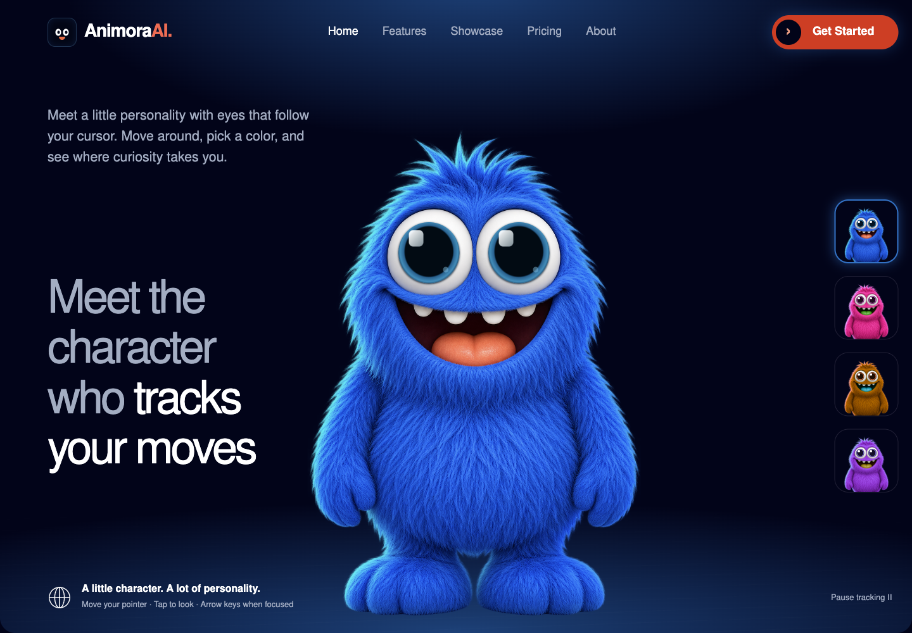
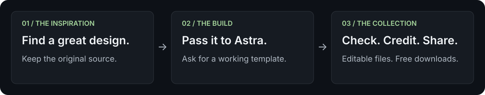
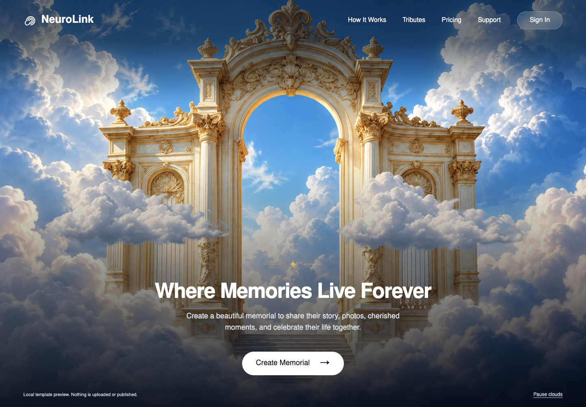
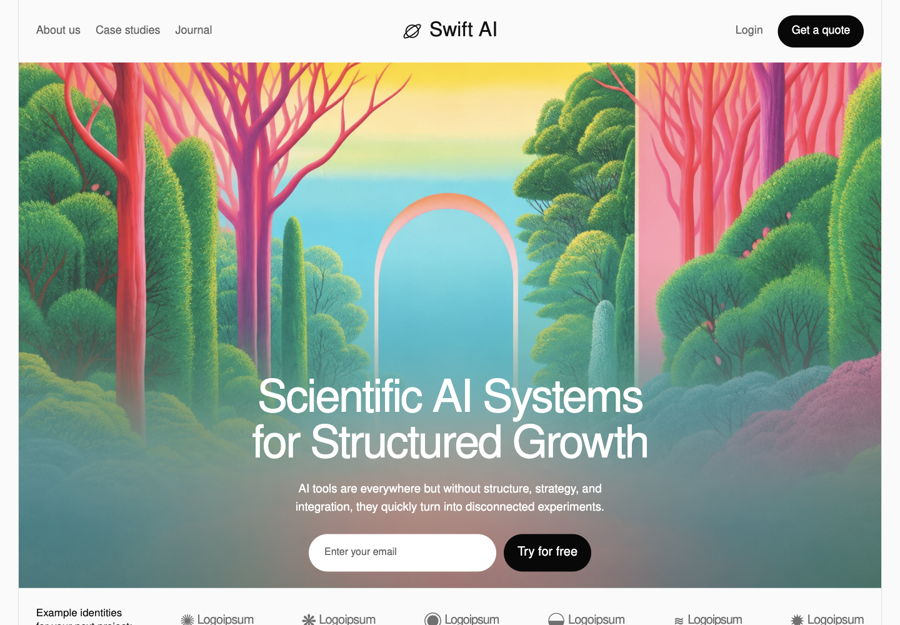
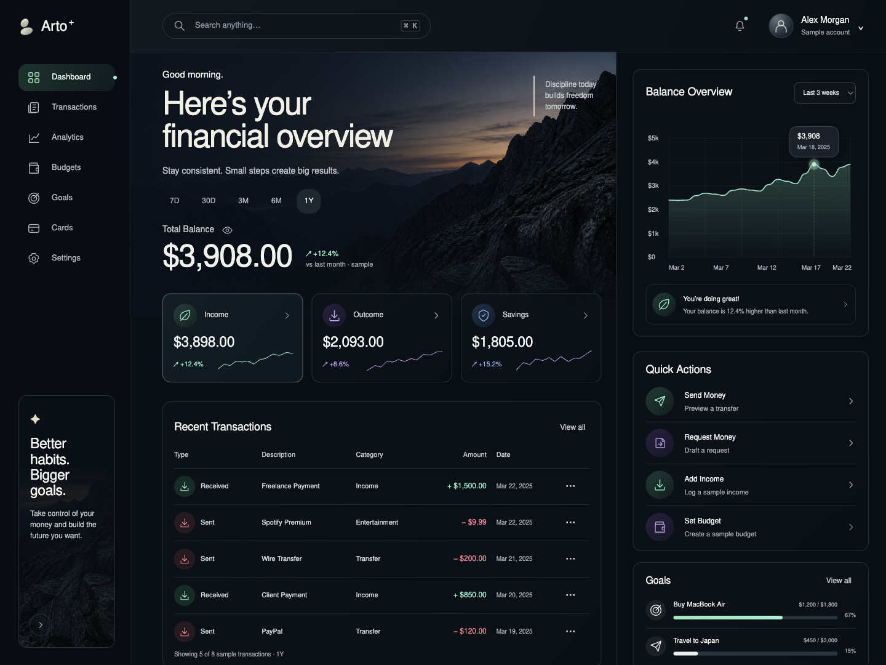
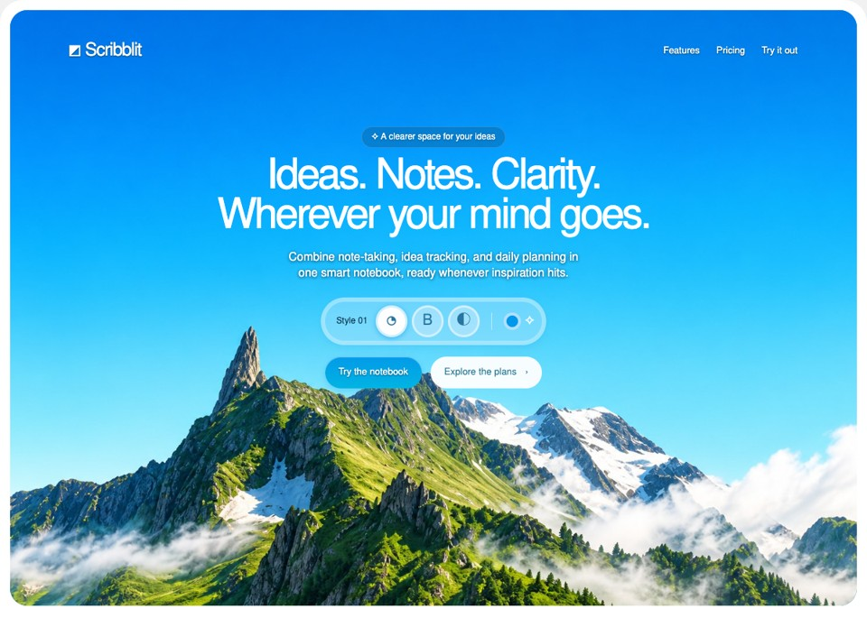
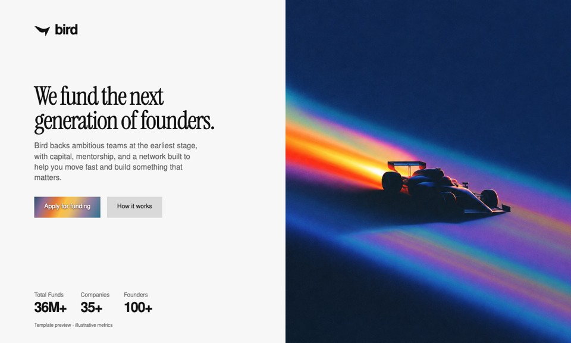
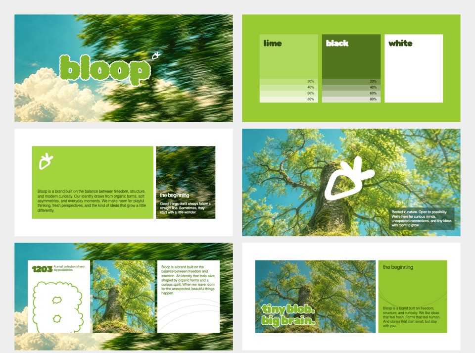
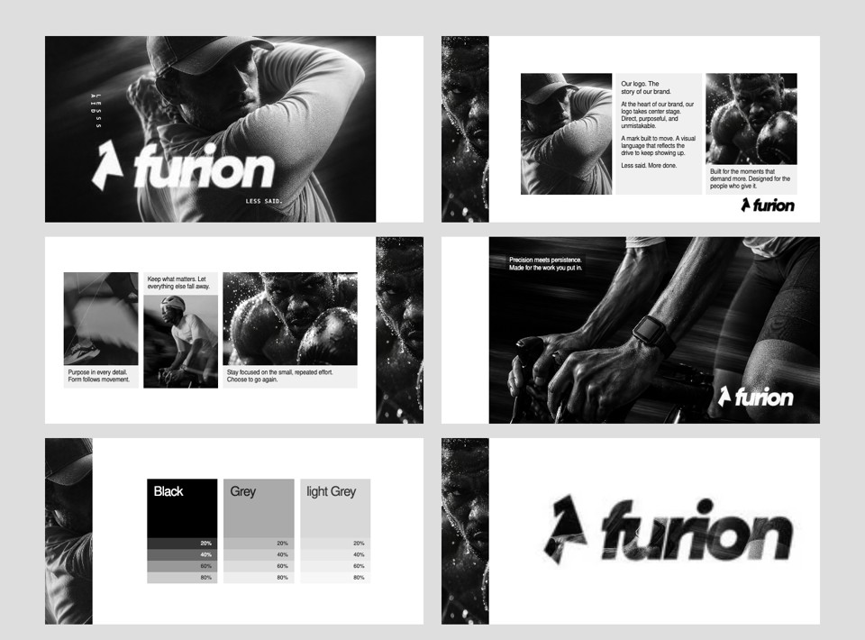
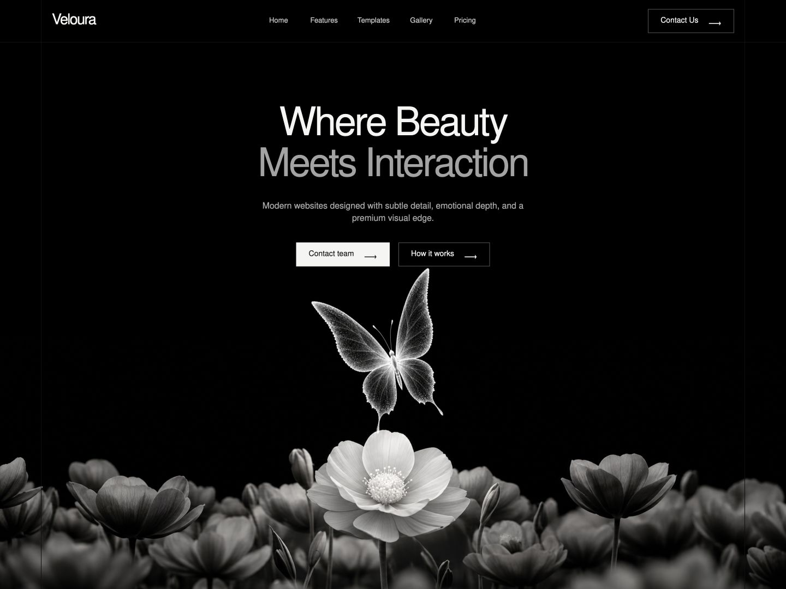

<div align="center">
  
  <h1>Great designs. Free web templates.</h1>
  <p><strong>I find a design I love, pass it to Astra, and ask for a working template in one shot.</strong></p>
  <p>19 templates · Editable HTML, CSS &amp; JavaScript · Free downloads</p>
  <p><a href="https://x-web-templates.pages.dev/">Browse the live collection ↗</a> · <a href="#templates">See every template</a> · <a href="#quickstart">Run locally</a> · <a href="#credits">Original creators</a></p>
  <p><strong>If you find something you love, give this repo a ⭐</strong></p>
  <a href="https://x-web-templates.pages.dev/animora/"></a>
  <p><sub>AnimoraAI · Reference by <a href="https://x.com/iamtanzil_/status/2098018663089533246">Tanzil Chowdhury</a> · Template made with Astra</sub></p>
</div>

## The story

I keep seeing great design work and thinking: I want to build that.

So I pass the reference to Astra and ask it to turn the design into a usable web template in one shot. Some of the results are so fucking good, I had to share them. This repo is that collection, free to download and play with.

The design inspiration belongs to the original creators. I’m doing my best to credit them and link the original posts. If I’ve missed someone or got a credit wrong, [open an issue](https://github.com/ali-abassi/x-web-templates/issues).

I check the results and make fixes and refinements where needed before adding them here. Aster came from my earlier template repo.

**Find something useful? Star the repo so more people can find it.**

## Quickstart

**Just want one?** [Pick a template in the gallery](https://x-web-templates.pages.dev/), download its ZIP, and unzip it. Each download includes the site, local assets, a customization guide, and font notices. No account, API key, or package install.

To run the whole collection, use Git and Python 3:

```sh
git clone https://github.com/ali-abassi/x-web-templates.git
cd x-web-templates
python3 -m http.server 8080 --bind 127.0.0.1 --directory dist
```

```text
Serving HTTP on 127.0.0.1 port 8080 (http://127.0.0.1:8080/) ...
```

Open [localhost:8080](http://localhost:8080). Stop the server with Ctrl+C. It binds only to your own computer.

## How it works



1. **Find a design.** Save the screenshot, clip, or page and its original source.
2. **Pass it to Astra.** Ask for a working template from that reference.
3. **Check and share.** Review the result, fix what needs attention, add credits, and package the HTML, CSS, JavaScript, and assets.

There’s no generator service to configure here. This repo contains the finished templates.

## Templates

These are screenshots of the actual templates. Click an image to open the live preview; use **Source** for the files and customization notes. Reference links identify the source used, which may be a shared post rather than proof of authorship.

<table>
  <tr>
    <td width="50%" valign="top">
      <h3>AnimoraAI</h3>
      <a href="https://x-web-templates.pages.dev/animora/"></a>
      <p>A curious character with reactive eyes and four colorful worlds.</p>
      <p><a href="https://x-web-templates.pages.dev/animora/">Live preview ↗</a> · <a href="https://x-web-templates.pages.dev/downloads/animora.zip">Download ZIP</a> · <a href="templates/animora/">Source</a></p>
      <p><sub>Reference: <a href="https://x.com/iamtanzil_/status/2098018663089533246">Tanzil Chowdhury</a></sub></p>
    </td>
    <td width="50%" valign="top">
      <h3>Travio</h3>
      <a href="https://x-web-templates.pages.dev/travio/"></a>
      <p>An alpine escape with a phone, an airplane, and an open zipper.</p>
      <p><a href="https://x-web-templates.pages.dev/travio/">Live preview ↗</a> · <a href="https://x-web-templates.pages.dev/downloads/travio.zip">Download ZIP</a> · <a href="templates/travio/">Source</a></p>
      <p><sub>Reference: <a href="https://x.com/jibon33212/status/2098040111472800179">Farhan ahmed Jibon</a></sub></p>
    </td>
  </tr>
</table>

<table>
  <tr>
    <td width="50%" valign="top">
      <h3>NeuroLink</h3>
      <a href="https://x-web-templates.pages.dev/neurolink/"></a>
      <p>Golden gates, moving clouds, and a local tribute preview.</p>
      <p><a href="https://x-web-templates.pages.dev/neurolink/">Live preview ↗</a> · <a href="https://x-web-templates.pages.dev/downloads/neurolink.zip">Download ZIP</a> · <a href="templates/neurolink/">Source</a></p>
      <p><sub>Reference: <a href="https://x.com/aether_uiux/status/2097650553782510046">AETHER</a></sub></p>
    </td>
    <td width="50%" valign="top">
      <h3>Swift AI</h3>
      <a href="https://x-web-templates.pages.dev/swift-ai/"></a>
      <p>A vivid forest and an editable creative-project brief.</p>
      <p><a href="https://x-web-templates.pages.dev/swift-ai/">Live preview ↗</a> · <a href="https://x-web-templates.pages.dev/downloads/swift-ai.zip">Download ZIP</a> · <a href="templates/swift-ai/">Source</a></p>
      <p><sub>Reference: <a href="https://x.com/hussain_mu20778/status/2097891688777932949">Muddasir</a></sub></p>
    </td>
  </tr>
</table>

<table>
  <tr>
    <td width="50%" valign="top">
      <h3>Arto+</h3>
      <a href="https://x-web-templates.pages.dev/arto/"></a>
      <p>A mountain-framed dashboard with charts and transaction search.</p>
      <p><a href="https://x-web-templates.pages.dev/arto/">Live preview ↗</a> · <a href="https://x-web-templates.pages.dev/downloads/arto.zip">Download ZIP</a> · <a href="templates/arto/">Source</a></p>
      <p><sub>Reference: <a href="https://x.com/andrewgurio/status/2097988488146870482/photo/1">Andrew Gurio</a></sub></p>
    </td>
    <td width="50%" valign="top">
      <h3>Verto</h3>
      <a href="https://x-web-templates.pages.dev/verto/"></a>
      <p>A fashion portrait that responds to scroll, with a local project brief.</p>
      <p><a href="https://x-web-templates.pages.dev/verto/">Live preview ↗</a> · <a href="https://x-web-templates.pages.dev/downloads/verto.zip">Download ZIP</a> · <a href="templates/verto/">Source</a></p>
      <p><sub>Reference: <a href="https://x.com/alexroyhe/status/2097505519397163100">Alex roy</a></sub></p>
    </td>
  </tr>
</table>

<table>
  <tr>
    <td width="50%" valign="top">
      <h3>Olympus</h3>
      <a href="https://x-web-templates.pages.dev/olympus/"></a>
      <p>Marble, orbit motion, and an illustrated AI workspace.</p>
      <p><a href="https://x-web-templates.pages.dev/olympus/">Live preview ↗</a> · <a href="https://x-web-templates.pages.dev/downloads/olympus.zip">Download ZIP</a> · <a href="templates/olympus/">Source</a></p>
      <p><sub>Reference: <a href="https://x.com/jxdhaa/status/2097647071721607222">Judha</a></sub></p>
    </td>
    <td width="50%" valign="top">
      <h3>Wandor</h3>
      <a href="https://x-web-templates.pages.dev/wandor/"></a>
      <p>Landmark illustrations and a downloadable example itinerary.</p>
      <p><a href="https://x-web-templates.pages.dev/wandor/">Live preview ↗</a> · <a href="https://x-web-templates.pages.dev/downloads/wandor.zip">Download ZIP</a> · <a href="templates/wandor/">Source</a></p>
      <p><sub>Reference: <a href="https://x.com/oiharshit/status/2097666212767633581">Harshit</a></sub></p>
    </td>
  </tr>
</table>

<table>
  <tr>
    <td width="50%" valign="top">
      <h3>Scribblit / Alpine Notes</h3>
      <a href="https://x-web-templates.pages.dev/alpine-notes/"></a>
      <p>A blue mountain product page with a working local notebook.</p>
      <p><a href="https://x-web-templates.pages.dev/alpine-notes/">Live preview ↗</a> · <a href="https://x-web-templates.pages.dev/downloads/alpine-notes.zip">Download ZIP</a> · <a href="templates/alpine-notes/">Source</a></p>
      <p><sub>Reference: <a href="https://x.com/DesignGuru01/status/2097570950543790295">Naty / DesignGuru01</a></sub></p>
    </td>
    <td width="50%" valign="top">
      <h3>Bird / Rainbow Venture</h3>
      <a href="https://x-web-templates.pages.dev/rainbow-venture/"></a>
      <p>A white venture page with rainbow racing imagery.</p>
      <p><a href="https://x-web-templates.pages.dev/rainbow-venture/">Live preview ↗</a> · <a href="https://x-web-templates.pages.dev/downloads/rainbow-venture.zip">Download ZIP</a> · <a href="templates/rainbow-venture/">Source</a></p>
      <p><sub>Reference: <a href="https://x.com/DesignGuru01/status/2097570950543790295">Naty / DesignGuru01</a></sub></p>
    </td>
  </tr>
</table>

<table>
  <tr>
    <td width="50%" valign="top">
      <h3>Bloop</h3>
      <a href="https://x-web-templates.pages.dev/bloop/"></a>
      <p>A six-panel identity board in lime and teal.</p>
      <p><a href="https://x-web-templates.pages.dev/bloop/">Live preview ↗</a> · <a href="https://x-web-templates.pages.dev/downloads/bloop.zip">Download ZIP</a> · <a href="templates/bloop/">Source</a></p>
      <p><sub>Reference: <a href="https://x.com/DesignGuru01/status/2097570950543790295">Naty / DesignGuru01</a></sub></p>
    </td>
    <td width="50%" valign="top">
      <h3>Furion</h3>
      <a href="https://x-web-templates.pages.dev/furion/"></a>
      <p>A monochrome sport identity with bold, italic typography.</p>
      <p><a href="https://x-web-templates.pages.dev/furion/">Live preview ↗</a> · <a href="https://x-web-templates.pages.dev/downloads/furion.zip">Download ZIP</a> · <a href="templates/furion/">Source</a></p>
      <p><sub>Reference: <a href="https://x.com/DesignGuru01/status/2097570950543790295">Naty / DesignGuru01</a></sub></p>
    </td>
  </tr>
</table>

<table>
  <tr>
    <td width="50%" valign="top">
      <h3>HorizonX</h3>
      <a href="https://x-web-templates.pages.dev/horizonx/"></a>
      <p>A navy-and-gold space scene with a moving ship.</p>
      <p><a href="https://x-web-templates.pages.dev/horizonx/">Live preview ↗</a> · <a href="https://x-web-templates.pages.dev/downloads/horizonx.zip">Download ZIP</a> · <a href="templates/horizonx/">Source</a></p>
      <p><sub>Reference: <a href="https://x.com/viktoroddy/status/2097500666357072243">Viktor Oddy</a></sub></p>
    </td>
    <td width="50%" valign="top">
      <h3>Pixel World</h3>
      <a href="https://x-web-templates.pages.dev/pixel-world/"></a>
      <p>A pixel-art valley, drifting clouds, and a desk-side robot.</p>
      <p><a href="https://x-web-templates.pages.dev/pixel-world/">Live preview ↗</a> · <a href="https://x-web-templates.pages.dev/downloads/pixel-world.zip">Download ZIP</a> · <a href="templates/pixel-world/">Source</a></p>
      <p><sub>Reference: <a href="https://x.com/orseliyas/status/2097307376143773730">Varun</a></sub></p>
    </td>
  </tr>
</table>

<table>
  <tr>
    <td width="50%" valign="top">
      <h3>BuzzKit</h3>
      <a href="https://x-web-templates.pages.dev/buzzkit/"></a>
      <p>Floating notifications and four editable dashboard views.</p>
      <p><a href="https://x-web-templates.pages.dev/buzzkit/">Live preview ↗</a> · <a href="https://x-web-templates.pages.dev/downloads/buzzkit.zip">Download ZIP</a> · <a href="templates/buzzkit/">Source</a></p>
      <p><sub>Reference: <a href="https://x.com/chroxify/status/2097477196130529296">Christo</a></sub></p>
    </td>
    <td width="50%" valign="top">
      <h3>Clipdock</h3>
      <a href="https://x-web-templates.pages.dev/clipdock/"></a>
      <p>A notched navigation bar and a local clipboard demo.</p>
      <p><a href="https://x-web-templates.pages.dev/clipdock/">Live preview ↗</a> · <a href="https://x-web-templates.pages.dev/downloads/clipdock.zip">Download ZIP</a> · <a href="templates/clipdock/">Source</a></p>
      <p><sub>Reference: <a href="https://www.supaste.com/">Supaste</a></sub></p>
    </td>
  </tr>
</table>

<table>
  <tr>
    <td width="50%" valign="top">
      <h3>GRID01 / Leo Mazzi</h3>
      <a href="https://x-web-templates.pages.dev/grid-driver/"></a>
      <p>A helmet reveal, pointer trails, and a racing circuit.</p>
      <p><a href="https://x-web-templates.pages.dev/grid-driver/">Live preview ↗</a> · <a href="https://x-web-templates.pages.dev/downloads/grid-driver.zip">Download ZIP</a> · <a href="templates/grid-driver/">Source</a></p>
      <p><sub>Reference: <a href="https://www.getlayers.ai/layer/kimi">Kimi / GetLayers</a></sub></p>
    </td>
    <td width="50%" valign="top">
      <h3>Aster</h3>
      <a href="https://x-web-templates.pages.dev/aster/"></a>
      <p>An observatory world from my original Aster template.</p>
      <p><a href="https://x-web-templates.pages.dev/aster/">Live preview ↗</a> · <a href="https://x-web-templates.pages.dev/downloads/aster.zip">Download ZIP</a> · <a href="templates/aster/">Source</a></p>
      <p><sub>Reference: <a href="https://github.com/ali-abassi/aster-landing-page-template">Original Aster repo</a></sub></p>
    </td>
  </tr>
</table>

<table>
  <tr>
    <td valign="top">
      <h3>Veloura</h3>
      <a href="https://x-web-templates.pages.dev/veloura/"></a>
      <p>A silver butterfly and a monochrome flower bed, with gently folding wings.</p>
      <p><a href="https://x-web-templates.pages.dev/veloura/">Live preview ↗</a> · <a href="https://x-web-templates.pages.dev/downloads/veloura.zip">Download ZIP</a> · <a href="templates/veloura/">Source</a></p>
      <p><sub>Reference: <a href="https://x.com/AltamashAyazz/status/2098071500934775112">Altamash</a></sub></p>
    </td>
  </tr>
</table>

## Credits

- **Veloura reference:** [Altamash / @AltamashAyazz — original post](https://x.com/AltamashAyazz/status/2098071500934775112). One monochrome butterfly-and-flowers hero; original generated art and independently authored CSS motion.

Thank you to the designers whose work made me want to try this in the first place. Please visit their original posts and give them some love.

The original four designs come from **[Naty / @DesignGuru01 — original X post](https://x.com/DesignGuru01/status/2097570950543790295)**. This collection reconstructs those references; it is not affiliated with their creator.

- **Aster:** Ali's [original Aster template repository](https://github.com/ali-abassi/aster-landing-page-template), imported with its MIT license. Its documented visual reference is [Unive](https://unive.ai/).
- **HorizonX reference:** [Viktor Oddy / @viktoroddy — original post](https://x.com/viktoroddy/status/2097500666357072243).
- **BuzzKit reference:** [Christo / @chroxify — original post](https://x.com/chroxify/status/2097477196130529296).
- **Pixel-world reference:** [Varun / @orseliyas — original post](https://x.com/orseliyas/status/2097307376143773730).

- **AnimoraAI reference:** [Tanzil Chowdhury / @iamtanzil_ — original post](https://x.com/iamtanzil_/status/2098018663089533246). Fifteen-second character/gaze clip.
- **Travio reference:** [Farhan ahmed Jibon / @jibon33212 — original post](https://x.com/jibon33212/status/2098040111472800179?s=46). A static travel-app splash composition with an alpine backdrop and airplane zipper.
- **Arto+ reference:** [Andrew Gurio / @andrewgurio — original post](https://x.com/andrewgurio/status/2097988488146870482/photo/1). Supplied dashboard screenshot.
- **NeuroLink reference:** [AETHER / @aether_uiux — original post](https://x.com/aether_uiux/status/2097650553782510046). Single visible gateway hero.
- **Swift AI reference:** [Muddasir / @hussain_mu20778 — original post](https://x.com/hussain_mu20778/status/2097891688777932949). First forest background only.
- **Verto reference:** [Alex roy / @alexroyhe — original post](https://x.com/alexroyhe/status/2097505519397163100).
- **Olympus reference:** [Judha / @jxdhaa — original post](https://x.com/jxdhaa/status/2097647071721607222).
- **Wandor reference:** [Harshit / @oiharshit — original post](https://x.com/oiharshit/status/2097666212767633581).

Olympus and Wandor reconstruct all sections from the supplied stills, using original artwork and newly authored motion. Their local examples do not connect to real AI services or bookings.

GRID01 references [Kimi / GetLayers](https://www.getlayers.ai/layer/kimi). Clipdock references [Supaste](https://www.supaste.com/), discovered through Navbar Gallery. Their individual READMEs link the exact reference pages.

<details>
<summary>Design discovery libraries</summary>

More references shared by Ali, via **[Dzianis Kravchu / @thedzianis — original post](https://x.com/thedzianis/status/2097600028416381178)**:

| Library | Useful for |
| --- | --- |
| [GetLayers](https://www.getlayers.ai/) | Cinematic website templates, immersive website prompts and 3D scene prompts |
| [Navbar Gallery](https://www.navbar.gallery/) | Navigation patterns: static bars, dropdowns, mega menus and sidebars |
| [Supahero](https://supahero.io/) | Website hero-section references |
| [404s](https://www.404s.design/) | Creative error-page designs |
| [Footer](https://www.footer.design/) | Footer layouts and design references |
| [CTA Gallery](https://www.cta.gallery/) | Call-to-action sections |
| [Unsection](https://www.unsection.com/) | Website sections, including heroes, pricing and calls to action |

The retained motion selections are **Kimi → GRID01** and **Supaste → Clipdock**.

</details>

## Make it yours

Edit `templates/<name>/dist/` for the template you want. Start with the copy, colors, images, and links. The template’s README covers its interactions and customization points. You don’t need a framework config or an environment file.

| You want to… | Do this |
| --- | --- |
| Preview the included sites | Run the Quickstart above |
| Edit a template | Change its files under `templates/<name>/dist/` |
| Rebuild the catalog and ZIPs | `npm run build` |
| Check assets, links, JS syntax, and ZIP parity | `npm run check` |
| Host one template | Upload that template’s built `dist/` folder to your static host |

For rebuilds and checks, install Python 3 and Node.js with npm. No `npm install` is needed:

```sh
npm run build
npm run check
```

Final lines from the verified run:

```text
Built 19 independent sites, the gallery, and reproducible ZIPs.
PASS: 20 pages, local links/anchors, image attributes, JS syntax, and 19 exact ZIPs.
```

The quickstart and checks were run on macOS with Python 3.14.7, Node.js 26.8.1, and npm 11.19.0. The included sites are plain static files; the hosted collection is verified on Cloudflare Pages. Other hosts and older runtimes are not exhaustively tested.

### What’s inside

- `templates/` — editable source, per-template notes, and asset notices.
- `gallery/` — the collection page and real preview screenshots.
- `shared/` — CSS and local UI helpers used by the original four templates.
- `dist/` — generated previews and matching, self-contained ZIPs.
- `evidence/` — reference comparisons, generation provenance, browser checks, and known limits.

**Edit the source, not the root `dist/` output.** Rebuilding replaces generated files and removes stale output. The original four combine source with shared helpers; other templates stay independent. ZIPs are built from the same files as the previews.

### When this is a good fit

Use these for learning, visual experiments, prototypes, and a starting point you can edit. The demos have working local interactions, but they are not complete businesses or connected products.

If you want a visual editor and managed publishing, [Framer](https://www.framer.com/) may suit you better. If you want a full application with routing and server features, [Next.js](https://nextjs.org/) is a different starting point. This collection is for opening the files and making them your own.

## Reuse and demo limits

**Free to download does not mean every referenced design or asset has a blanket commercial license.** Credit is not permission, and this repository does not grant rights to the original designers’ work. Check each template’s notices before reusing it. Aster retains its MIT license; font licenses ship with the downloads.

Bird retains a small reference-study crop. Furion retains two small crops and a raster wordmark. Those retained assets have no new license: replace them or obtain rights before commercial reuse. Generated artwork and independently written code are identified in the provenance; exact original photography and proprietary fonts are not claimed.

Forms and dashboards are local demonstrations. They do not book travel, move money, send messages, create accounts, or connect to real AI services. Some inputs persist in browser storage; don’t enter sensitive information into public demos. Replace sample names, metrics, testimonials, contact details, and links before publishing your own site. No API keys or backend credentials are required for the included templates.

<details>
<summary>Template-specific behavior and provenance</summary>

Alpine stores one note on this browser/origin using the original `scribblit-note` key, so existing demo notes survive the redesign. Saving is explicit. Export remains available if storage is denied. It does not sync notes or provide the example plan features.

Bird generates a local application text draft with required/email and whitespace validation. Nothing is submitted. The form is disabled with an explanation without JavaScript. Metrics and portfolio names are illustrative.

Bloop and Furion are identity boards. Their template disclosures and brand-note downloads work without JavaScript.

Aster preserves the original source and MIT license from your separate repository. Its animated reveals require JavaScript unless reduced motion is enabled. Product reviews, metrics and features are illustrative.

HorizonX is a two-section reconstruction with generated space artwork and a separate ship layer. Its lower disclosures are editable local template information.

BuzzKit is an independent design reconstruction, not the notification backend. Dashboard controls inside the preview are illustrative; the four scene selectors, pause, preference switches, copy prompt, FAQs and links work. Preference changes are local to the current page. Docs and pricing links go to the original project.

Pixel World preserves the source portfolio’s layout and links to Varun’s reference projects; they are not Ali’s work. Its contact form downloads a local draft without sending anything. Replace names, projects and contact behavior before publishing your own portfolio.

`npm run check` verifies every generated page, local links and anchors, image dimensions/alt attributes, JavaScript syntax, and exact ZIP-to-preview parity. The original four’s comparisons are in [reference-match evidence](evidence/reference-match/). The additions, source snapshots, image prompts, video-analysis receipts and browser checks are in [collection-expansion evidence](evidence/collection-expansion/). The earlier `evidence/redesign` describes a rejected interpretation and does not approve this candidate.

The original imported source is retained at `8db60a8`. Ten replacement photographs for the original four and five new scene layers were generated with native ChatGPT imagegen. Provenance for the original four is in `evidence/reference-match/generated-assets.json`; new image prompts and usage are in `evidence/collection-expansion/`. Bird retains one small reference study crop; Furion retains two small crops and its raster wordmark. These retained assets carry no new license: replace them or obtain rights before commercial reuse. Fonts include license notices. Exact proprietary fonts and identical photography are not claimed.

Original ChatGPT Site source: `2041d91ef089c77106c542fe5c7fa5290307759b`. Historical inspiration: [Naty / DesignGuru01](https://x.com/designguru01/status/2097570950543790295). The original hosted Site and separate Aster repository are unchanged.

</details>

### Verification and status

The build checks cover all **19 templates and 19 ZIPs**: generated page inventory, local links and anchors, image attributes, JavaScript syntax, and exact ZIP parity. They are not a certification of every browser, accessibility scenario, backend integration, or reference-perfect design. Per-template browser evidence and remaining differences are retained under `evidence/`.

The collection is public and the gallery is live. Git pushes do not currently deploy Pages automatically. This is a growing personal collection, not an official Astra or original-creator product.

[Browse the gallery](https://x-web-templates.pages.dev/) · [Report a bug or credit correction](https://github.com/ali-abassi/x-web-templates/issues) · [Inspect the source](templates/)

---

**Built because the designs were too good to leave as screenshots. Shared because you might make something great with them.**

If this saves you a blank canvas, **give the repo a star ⭐**.
